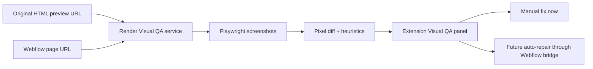

# Playwright Visual QA Blueprint

## Summary
Add a Playwright-powered Visual QA service that compares the original exported HTML site against the imported Webflow page after paste/cleanup. The goal is to catch visual drift automatically and turn it into section-level repair guidance.

This must run outside the Webflow Designer Extension and outside Cloudflare/Webflow Cloud. The recommended runtime is Render.com because Playwright needs a Node server with browser binaries and filesystem access for screenshots.

## Problem
The current builder converts source HTML/CSS into native Webflow structures. That preserves structure and many styles, but it does not prove the Webflow result visually matches the source.

The current manual review loop misses or delays issues like:
- hero height and image crop changes
- nav/logo scale drift
- incorrect max-width and section padding
- grid columns collapsing or spacing differently
- font size, line-height, weight, and casing differences
- image object-fit/object-position mismatches
- footer density and alignment changes

## Architecture


## Runtime Boundary
### Runs on Render
- Playwright browser launch
- screenshot capture
- selector cropping
- pixel diff generation
- artifact storage for screenshots/diffs
- heuristic report generation

### Runs in Webflow Builder extension
- collect URLs and section selector
- call the Visual QA service
- show score, screenshots, diff, and likely causes
- later: apply selected repair actions through the Webflow bridge

### Runs in existing Cloud/Webflow backend
- repo sync and source metadata remain unchanged
- optional future endpoint can serve original HTML previews from repo snapshots
- Cloudflare/Webflow Cloud should not run Playwright

## Source URL Strategy
The Visual QA service compares URLs, not local files.

Required inputs:
- `originalUrl`: the original Figma Make/GitHub HTML export rendered in a browser
- `webflowUrl`: the Webflow staging/published/designer preview URL
- `selector`: optional CSS selector for the section, for example `#hero`, `.section_hero`, or `[data-section="hero"]`

Recommended original HTML options:
- deploy the Figma Make static export to a preview host
- run a local preview only when the Visual QA service is also local
- future: add a backend preview endpoint that renders a synced repo page/section from stored snapshots

Render cannot access `localhost` on the user machine, so local original HTML only works with a local Visual QA server.

## API Contract
Endpoint:

```http
POST /visual-qa/compare
```

Request:

```json
{
  "originalUrl": "https://preview.example.com/",
  "webflowUrl": "https://example.webflow.io/",
  "selector": "#hero",
  "threshold": 0.12,
  "viewports": [
    { "name": "desktop", "width": 1440, "height": 1200 },
    { "name": "tablet", "width": 991, "height": 1200 },
    { "name": "mobile", "width": 390, "height": 1200 }
  ]
}
```

Response:

```json
{
  "generatedAt": "2026-07-08T00:00:00.000Z",
  "originalUrl": "https://preview.example.com/",
  "webflowUrl": "https://example.webflow.io/",
  "selector": "#hero",
  "threshold": 0.12,
  "passed": false,
  "averageMismatchRatio": 0.23,
  "results": [
    {
      "name": "desktop",
      "width": 1440,
      "height": 1200,
      "mismatchRatio": 0.18,
      "passed": false,
      "originalScreenshot": "https://visual-qa.example.com/artifacts/job/original-desktop.png",
      "webflowScreenshot": "https://visual-qa.example.com/artifacts/job/webflow-desktop.png",
      "diffScreenshot": "https://visual-qa.example.com/artifacts/job/diff-desktop.png",
      "notes": [
        "Mismatch is concentrated above the fold; check hero height, image crop, and nav spacing."
      ]
    }
  ],
  "warnings": []
}
```

Shared schemas live in `packages/shared/src/contracts.ts`:
- `visualQaCompareRequestSchema`
- `visualQaCompareResponseSchema`

## Render Service Blueprint
Create a separate Node service, not a Cloudflare Worker.

Recommended package:

```json
{
  "scripts": {
    "start": "node dist/server.js",
    "dev": "tsx src/server.ts",
    "build": "tsc -p tsconfig.json",
    "postinstall": "playwright install --with-deps chromium"
  },
  "dependencies": {
    "@wfb/shared": "file:../packages/shared",
    "express": "^4.18.3",
    "pixelmatch": "^5.3.0",
    "playwright": "^1.55.0",
    "pngjs": "^7.0.0",
    "zod": "^4.1.5"
  },
  "devDependencies": {
    "@types/express": "^4.17.21",
    "@types/node": "^24.3.0",
    "tsx": "^4.20.3",
    "typescript": "^5.9.2"
  }
}
```

Render settings:
- Environment: Node
- Build command: `npm install && npm run build`
- Start command: `npm start`
- Disk: optional, for screenshot artifacts
- Env:
  - `PORT`
  - `VISUAL_QA_ALLOWED_HOSTS`, comma-separated allowlist for production
  - `VISUAL_QA_ARTIFACT_BASE_URL`, public URL for artifact links
  - `VISUAL_QA_MAX_VIEWPORTS=3`
  - `VISUAL_QA_NAVIGATION_TIMEOUT_MS=45000`

The repo includes a Render Blueprint at `render.yaml` for this service.

## Screenshot Algorithm
For each viewport:
1. Launch Chromium.
2. Open `originalUrl` and `webflowUrl`.
3. Set identical viewport dimensions.
4. Wait for network idle plus a short font/image settle delay.
5. If `selector` is provided, locate the matching element on both pages.
6. Screenshot the element or full page.
7. Normalize screenshot dimensions by cropping to the shared minimum width/height.
8. Run `pixelmatch`.
9. Save original, Webflow, and diff artifacts.
10. Return mismatch ratio and notes.

## Heuristics V1
The first pass should only produce guidance, not automatic mutation.

Rules:
- high top-third mismatch: check nav, hero height, image crop, and first section spacing
- high center mismatch: check grid columns, card width, max-width, and image sizing
- high full-page mismatch with low top mismatch: check cumulative section padding and footer spacing
- selector missing on one page: fail fast with an actionable warning
- screenshot height differs heavily: likely missing content, collapsed layout, or wrong section selector

## Extension Flow
Add Visual QA after `Clean up paste`.

Paste screen:
- keep existing `Clean up paste`
- add `Run visual QA`
- show config warning if `VITE_VISUAL_QA_BASE_URL` is missing
- fields:
  - original URL
  - Webflow URL
  - selector
- show:
  - pass/fail
  - average mismatch
  - per-viewport mismatch
  - links/images for original, Webflow, and diff
  - notes

Recommended defaults:
- `webflowUrl`: infer from current site domain and mapped page route when available
- `selector`: section id/class from the source section when available
- `originalUrl`: user-provided until repo preview hosting exists

## Repair Loop V2
After the report is reliable, add repair actions:
- update Webflow class spacing from source CSS
- fix image `object-fit`, `object-position`, width, and height
- restore grid/flex columns and gaps
- update typography size, weight, line-height, and max-width
- bind variables when literal colors/sizes match imported tokens

The extension should show proposed repairs before applying them. Each repair should map back to a Webflow class or selected element so it can be reviewed and rolled back.

## Security
- Reject non-HTTP(S) URLs.
- In production, require `VISUAL_QA_ALLOWED_HOSTS`.
- Block private-network hosts unless explicitly allowed for local development.
- Limit viewports, screenshot size, request body size, and total run time.
- Do not execute arbitrary user scripts beyond normal page rendering.
- Redact cookies and never forward Webflow auth credentials to the service.

## Test Plan
- Unit test URL allowlist and private-host blocking.
- Unit test request/response schema validation.
- Integration test comparing two fixture HTML pages with an intentional spacing change.
- Integration test selector missing on original page.
- Integration test selector missing on Webflow page.
- Extension test showing the missing-config state.
- Extension test showing pass/fail result rendering.

## Rollout
1. Land shared contracts and this blueprint.
2. Add the Render service skeleton.
3. Deploy Render service and set `VITE_VISUAL_QA_BASE_URL`.
4. Add extension UI on the Paste screen.
5. Compare original HTML preview vs Webflow page manually.
6. Add repair suggestions once reports are stable.
